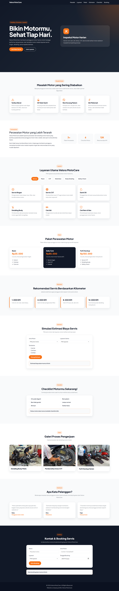

## Referensi Desain

1. CarServ - Free Bootstrap 5 Auto Repair Website Template  
   https://themewagon.com/themes/free-html5-bootstrap-5-business-website-template-carserv/  
   Digunakan sebagai referensi struktur company profile otomotif seperti navbar, hero, service section, booking form, dan contact section.

2. AutoWash - Free Car Wash Website Template  
   https://htmlcodex.com/car-wash-website-template/  
   Digunakan sebagai referensi layout pricing, service package, booking, dan tampilan layanan detailing.

3. Dribbble - Car Detailing Landing Page Inspiration  
   https://dribbble.com/search/car-detailing-landing-page  
   Digunakan sebagai referensi gaya visual modern, card layanan, CTA, dan tampilan landing page otomotif.

Desain akhir dimodifikasi pada bagian warna, konten, layout section, gambar, dan fitur interaktif agar sesuai dengan konsep Velora MotoCare sebagai layanan perawatan dan detailing motor harian.

## Hasil Screenshot FullPage
